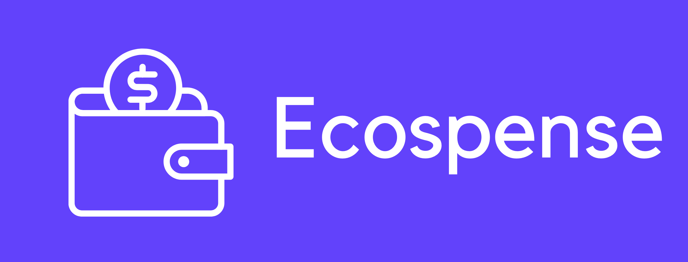

<h1 align="center">
  <br>
  <a href="https://ecospense.kaush.me">
  </a>
  <br>
  Ecospense
  <br>
</h1>

<h4 align="center">An open source expense tracker web app to help you save up and spend thoughtfully. 
<!-- <a href="http://nextjs.org/" target="_blank">Nextjs</a>. -->
</h4>

<p align="center">
  <a href="#"></a>
  <a href="#"></a>
  <a href="https://github.com/k4u5h4L"></a>
  <a href="#"></a>
  <a href="#"></a>
  <a href="#"></a>
</p>

<p align="center">
  <a href="#getting-started">Getting Started</a> •
  <a href="#key-features">Key Features</a> •
  <a href="#tools-used">Tools Used</a> •
  <a href="#development-setup">Development Setup</a> •
  <a href="#misc">Misc</a>
</p>

## Getting Started

You can head over to [ecospense.kaush.me](https://ecospense.kaush.me) and start using the site! You'll need to create an account before you can do anything though.

If you want to self host, please head on to <a href="#development-setup">Development Setup</a> to see how to set up on your local machine.

## Key Features

[x] Real time management of funds.
[x] Support for multiple accounts.
[x] You can now add goals and track how much you have saved for it.
[] Analytics/future forecasting your spending habits.
[x] External news articles right in the app!
[x] Passwordless logins! Just enter your email and use the OTP!
[x] Cross platform usability, both on Android and iOS using PWA technology. (UI is currently not really optimised for desktop users).
[x] Support for 25+ most traded currencies.
[] Chat with an AI helper regarding spending and other financial advice (probably will use an external AI modal like ChatGPT here).
[x] Quick convertion of currencies with real time exchange rates.
[] Logging of history of transitions and activities with scope to reverse transactions.
[] Support for tracking monthly bills and instant payment responses.
[x] Easily self hostable with just a vercel account, MongoDB access, news API keys and SMTP keys.

To find more features or want to see the future roadmap, head on to the [issues section](https://github.com/k4u5h4L/Ecospense/issues).

## Tools Used

-   Next.js as a full stack React framework.
-   Typescript as the type safe layer over Javascript.
-   Next-auth for authentication and passwordless logins.
-   GraphQL as the API language.
-   Apollo client and Apollo server graphql implementations on the client and server respectively.
-   Nexus as the GraphQL schema management.
-   MongoDB as the primary database.
-   Prisma as the database ODM.
-   Apexcharts to visualise graphs and charts.
-   Framer motion to handle page animations.
-   Gmail SMTP to send emails.
-   Brain.js (tentatively) as the ML lib to forecast spending habits.
-   Dicebear to generate fun profile pictures.

## Development Setup

```bash
# Clone this repository
$ git clone https://github.com/k4u5h4L/Ecospense.git ecospense

# Navigate into the repository
$ cd ecospense

# Install dependencies
$ yarn install

# Add required API keys and other secrets in a `.env` file. You can check the `.env.sample` file to view the different API keys which are required.

# Run the development server
$ yarn dev

# To create a production build and start, run
$ yarn run build && yarn start
```

A server would have start on [localhost:3000](http://localhost:3000/).

> **Note**
> If you're using `npm`, see corresponding commands for `npm` as opposed to `yarn`.

## Misc

Ecospense is a free software, and is developed by me as a side project. I am not responsible for any issues which may arise when the site is self hosted. I will not sell any user data if you intend to use the current version at [ecospense.kaush.me](https://ecospense.kaush.me). However, it is advised to enter any confidential information on the site, there is a reason I am not connecting it to any banking solution as this is purely a personal tracker with no correspondence to correctness of your account details.
